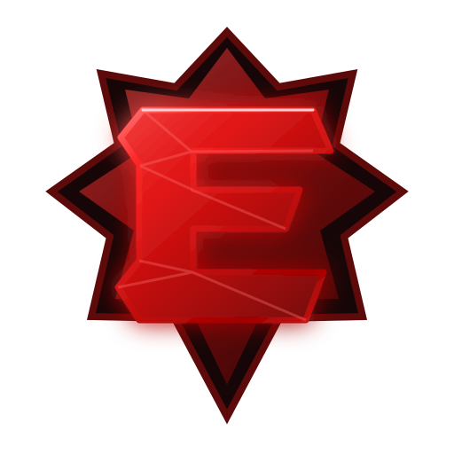
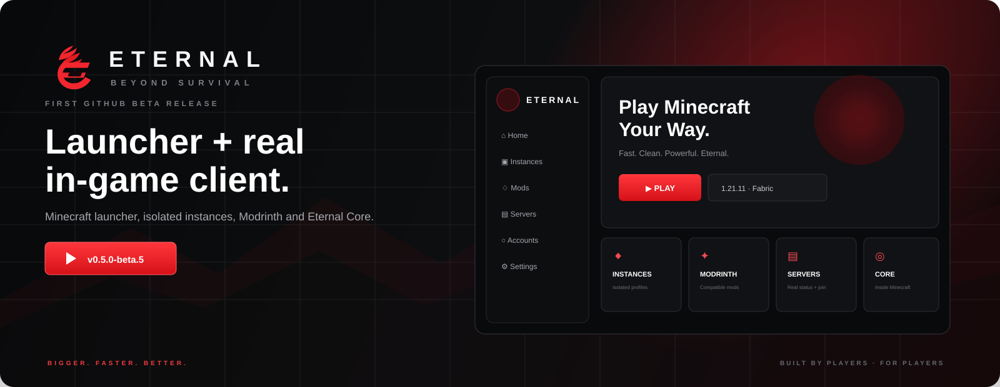

<p align="center"></p>
<h1 align="center">ETERNAL CLIENT</h1>
<p align="center"><b>Beyond survival.</b></p>
<p align="center">A premium Minecraft Java <b>launcher + real in-game client</b> with isolated instances, Microsoft/offline accounts, Modrinth, real server tools, and Eternal Core running inside Minecraft.</p>

<p align="center">


</p>
<p align="center"><a href="../../actions/workflows/ci.yml"></a></p>

<p align="center"></p>

> [!IMPORTANT]
> **Eternal is real beta software, not a mock launcher.** If a control looks usable, it must execute a real action. Fake player counts, fake progress, fake partner controls and fake success states are not accepted.

## v0.6.0-beta.6 — reference-locked UI + startup reliability

Beta 6 is built around the black/crimson Eternal reference direction: wider labelled sidebar, cinematic Play screen, red E emblem, compact premium panels, fast motion, Command Center, HUD panel, Accounts and Instances dashboard, and a matching Eternal Core page.

The UI is intentionally connected to real launcher state:

- **Play** launches the selected real instance.
- **Instances** shows actual saved profiles and running state.
- **Accounts** shows real Microsoft/offline profiles.
- **Mods** uses Modrinth filtered by the selected Minecraft version + loader.
- **Servers** uses real Minecraft status / latency / player-count handling.
- **Downloads** is driven by launcher activity instead of random percentages.
- **Eternal Core** describes and launches the implemented in-game client target.

## Beta 5 startup crash fixed

Beta 5 could fail before the window opened because `electron-updater` is CommonJS and the packaged Electron runtime rejected a named ESM import:

```text
SyntaxError: Named export 'autoUpdater' not found
```

Beta 6 loads the package through its default CommonJS export. More importantly, CI now **packages the Windows app and starts the real packaged EXE with `--smoke-test`** before a release is allowed to publish. A build that crashes in the Electron main process is rejected.

## Launcher + in-game client

```text
Eternal Launcher
   ↓
Isolated Minecraft instance
   ↓
Correct Java + Minecraft + loader
   ↓
Real Minecraft process
   ↓
Verified Eternal Core JAR on supported profile
   ↓
ClickGUI / HUD / Zoom inside Minecraft
```

## Real launcher work

- Isolated per-profile `.minecraft` directories.
- Vanilla + Fabric launch paths.
- Multiple Minecraft child processes per instance.
- Microsoft OAuth → Xbox Live → XSTS → Minecraft Services ownership/profile flow.
- Offline accounts with Minecraft-compatible deterministic UUIDs.
- Java detection and version checks.
- Modrinth search/install with actual version + loader compatibility filtering.
- Local mod enable/disable without rewriting JAR contents.
- Minecraft protocol server status / latency / player counts.
- Quick-play server launch.
- Real launcher diagnostics and packaged startup smoke tests.
- Windows NSIS installer + portable build + SHA256 release hashes.

## Eternal Core

Current certified target: **Minecraft 1.21.11 + Fabric**.

Current implemented features:

| Feature | Current behavior |
|---|---|
| ClickGUI | `Right Shift` opens the in-game Eternal interface |
| HUD editor | `H` opens draggable persistent HUD placement |
| Zoom | hold `C`; previous FOV is restored on release |
| FPS | live Minecraft FPS |
| CPS | real left/right click activity |
| Keystrokes | live movement input |
| Coordinates | live player XYZ |
| Ping | current player-list latency |
| Speed | horizontal player movement |
| Direction | live direction/yaw |
| Memory | JVM heap usage |
| Session | elapsed Core runtime |

The in-game panel shown by the launcher is a preview of implemented functionality; the real interaction happens inside Minecraft.

## Build gates

Every beta release must pass:

```text
Eternal Core Gradle compile
        ↓
Node dependency install
        ↓
source + runtime tests
        ↓
Vite production renderer build
        ↓
Windows Electron package
        ↓
PACKAGED EXE STARTUP SMOKE TEST
        ↓
NSIS / portable artifacts
        ↓
SHA256 generation
        ↓
GitHub pre-release
```

## Build locally

Requirements: Windows 10/11, Node.js 20+ (22 recommended), JDK 21.

```powershell
Set-ExecutionPolicy -Scope Process Bypass
.\RUN-DEV-WINDOWS.ps1
```

Verified package build:

```powershell
Set-ExecutionPolicy -Scope Process Bypass
.\BUILD-WINDOWS.ps1
```

## Repository map

```text
Eternal-Client/
├─ electron/            Electron launcher backend
├─ src/                 React launcher UI
├─ eternal-core/        Fabric in-game client
├─ assets/              Eternal branding
├─ tests/               regression/source tests
├─ scripts/             build/Core helpers
└─ .github/workflows/   CI + release automation
```

## Beta limitations we do not fake

- Eternal Core is currently certified for **Fabric 1.21.11** only.
- Microsoft login needs your own Entra/Azure public-client application ID.
- Aternos privileged server controls require an authorized API/partnership; standard mode provides legitimate status/join/dashboard behavior instead.
- Other loaders/versions are not marked supported until their actual path is implemented and tested.

## Project rule

> **If a button looks functional, it must perform a real action. If a feature is not ready, Eternal says so instead of pretending.**

<p align="center"><b>ETERNAL CLIENT</b><br/><i>Bigger. Faster. Better.</i></p>
