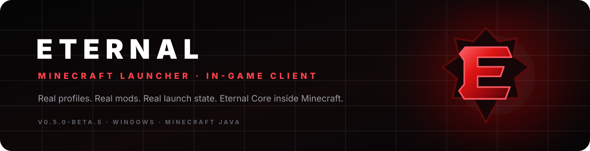

<p align="center"></p>
<h1 align="center">ETERNAL CLIENT</h1>
<p align="center"><b>The last client you'll ever need.</b></p>
<p align="center">A premium Minecraft Java <b>launcher + real in-game client</b>, built around a black/crimson interface, isolated instances, genuine launch state, Modrinth content, and Eternal Core inside Minecraft.</p>
<p align="center">


</p>
<p align="center"><a href="../../actions/workflows/ci.yml"></a></p>

<p align="center"></p>

> [!IMPORTANT]
> **Beta means beta.** Eternal does not show fake success, fake server players, fake progress, or fake privileged partner controls. A feature is only called release-ready after it actually passes its build/runtime gate.

## Launcher + client, not launcher-only

```text
Eternal Launcher
   ↓
Isolated Minecraft instance
   ↓
Correct Minecraft + loader + Java
   ↓
Real Minecraft process
   ↓
Eternal Core (supported profile)
   ↓
HUD / ClickGUI / Zoom inside Minecraft
```

The launcher UI targets the compact premium feel of modern Minecraft clients such as Dawn, while the **red faceted Eternal E emblem, source code, UI system, and assets are original Eternal work**.

## ✦ v0.5.0-beta.5

### Launcher UI / UX
- Compact **68px icon rail** instead of a generic dashboard sidebar.
- Frameless Electron title bar with real minimize / maximize / close actions.
- Animated crimson player hero with real account and profile state.
- `Ctrl + K` **Command Center** for navigation, instances, and real launch actions.
- Real **Play / Launch Another / Stop** process states.
- Activity dock driven by launcher events instead of fake timers.
- Responsive layout and `prefers-reduced-motion` support.
- Original faceted red **E** emblem used by the launcher, splash screen, and README.

### Real launcher work
- Per-profile isolated `.minecraft` directories.
- Vanilla launch path through `minecraft-launcher-core`.
- Fabric loader profile resolution from `meta.fabricmc.net`.
- Multiple Minecraft child processes tracked per instance.
- Offline accounts with Minecraft-compatible `OfflinePlayer:<name>` UUID semantics.
- Microsoft device-code auth source: Microsoft → Xbox Live → XSTS → Minecraft Services → ownership/profile validation. You must provide **your own** Entra/Azure public-client ID.
- Java runtime detection and version requirement checks.
- Local `.jar` add/remove/enable/disable without editing JAR contents.
- Modrinth search filtered by the instance's actual Minecraft version + loader, plus compatible-file installation.
- Minecraft TCP status handshake for genuine online/player/version/latency data.
- Aternos is intentionally limited to legitimate server-address/status/join/dashboard flows unless an authorized API is available.
- Fixed the Electron startup crash caused by `import tar from 'tar'`; the code uses `import * as tar from 'tar'`.

### Eternal Core — actually inside Minecraft
Current source target: **Minecraft 1.21.11 + Fabric Loader 0.18.1**.

| Feature | Implementation |
|---|---|
| ClickGUI | `Right Shift` opens the real in-game module UI |
| HUD editor | `H` opens draggable HUD placement with persistent positions |
| Zoom | Hold `C`; Eternal changes FOV and restores the user's previous FOV on release |
| FPS | live Minecraft FPS |
| CPS | real left/right click timestamps |
| Keystrokes | live W/A/S/D input state |
| Coordinates | live player XYZ |
| Ping | current player-list latency |
| Speed | horizontal player velocity |
| Direction | live player yaw |
| Memory | JVM heap usage |
| Session | elapsed Eternal Core runtime |

The HUD is injected into Minecraft's real GUI render path through client mixins; it is **not** an Electron overlay pretending to be in-game.

## Current support

| Area | Beta 5 status |
|---|---|
| Vanilla profiles | Implemented |
| Fabric profiles | Implemented |
| Forge / NeoForge / Quilt | **Not exposed as working yet** |
| Offline accounts | Implemented |
| Microsoft auth flow | Implemented in source; live-account validation is a release gate |
| Local mods | Implemented |
| Modrinth search/install | Implemented |
| Server ping / quick join | Implemented |
| Eternal Core 1.21.11 | Active CI build target |
| Aternos privileged controls | Not faked; requires authorized API |

## Build

Requirements: Windows 10/11, Node.js 20+ (22 recommended), and JDK 21 for Eternal Core.

```powershell
# launcher development
Set-ExecutionPolicy -Scope Process Bypass
.\RUN-DEV-WINDOWS.ps1

# verified launcher package path
.\BUILD-WINDOWS.ps1
```

Eternal Core is built by GitHub Actions with Java 21 and Gradle. See `.github/workflows/ci.yml`.

## Verification philosophy

The launcher tests and renderer production build run in CI. Eternal Core also has its own real Java/Fabric compile gate. A green launcher build does not magically make a broken Core "working"; both sides have to pass.

The remaining hard gates are tracked in [`TEST-RESULTS.md`](TEST-RESULTS.md) and [`RELEASE-CHECKLIST.md`](RELEASE-CHECKLIST.md).

## Repository

```text
Eternal-Client/
├─ electron/            Electron main process + real launcher services
├─ src/                 React launcher UI
├─ eternal-core/        Fabric in-game client source
├─ assets/              Original Eternal branding
├─ tests/               Source regression tests
├─ scripts/             Verification helpers
└─ .github/workflows/   Launcher + Eternal Core CI
```

## Project rule

> **If a button looks functional, it must execute a real action. If a feature is not ready or not authorized, Eternal says so instead of pretending.**

<p align="center"><b>ETERNAL CLIENT</b><br/><i>The last client you'll ever need.</i></p>
