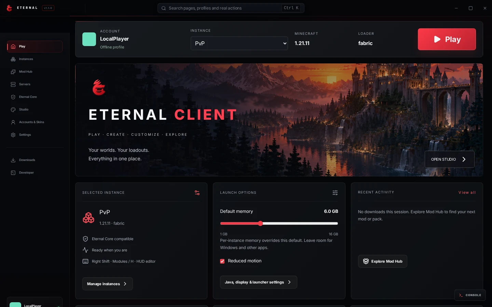
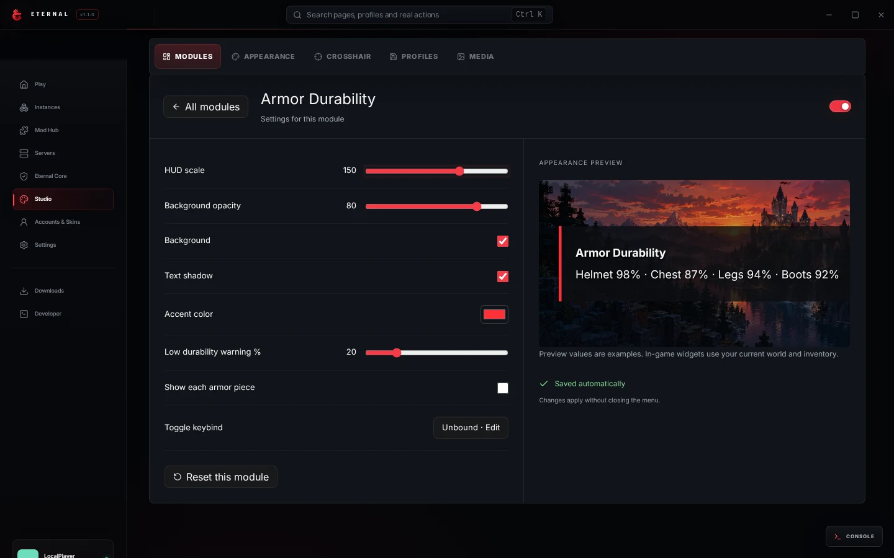

<p align="center"></p>
<h1 align="center">ETERNAL CLIENT</h1>
<p align="center"><strong>Your world. Your edge.</strong><br>A Minecraft launcher, a personal HUD, and a workspace that feels like yours.</p>

<p align="center">
  
  
  
  
</p>

<p align="center">
  <a href="https://1x1x1x1x1-ammar.github.io/Eternal-Client/client.html"><strong>Explore the client</strong></a> ·
  <a href="https://github.com/1x1x1x1x1-Ammar/Eternal-Client/releases/tag/v1.2.1"><strong>Download v1.2.1</strong></a> ·
  <a href="https://discord.gg/HaN8HxzqCV">Join Discord</a> ·
  <a href="https://github.com/1x1x1x1x1-Ammar/Eternal-Client/issues">Report an issue</a>
</p>

<p align="center"><br><sub>Launcher interface preview with a demo profile and simulated game connection.</sub></p>

## One workspace. Your Minecraft.

Eternal pairs a Windows/Linux launcher with **Eternal Core**, a Fabric mod that also works with your existing launcher. Keep your instances separate, install mods and packs, shape your HUD and bring your own skin. The launcher-managed Core and standalone JAR share the same in-game interface and settings.

| In the launcher | Inside Minecraft |
| :--- | :--- |
| Isolated Vanilla and Fabric instances | Right Shift menu and HUD editor |
| Modrinth discovery and installation | Drag, snap and save your HUD layout |
| Microsoft sign-in and offline profiles | FPS, ping, CPS, keystrokes and coordinates |
| Skin Studio with classic/slim previews | Attack cooldown, durability and supplies |
| Saved servers, ping and join actions | Crosshair, zoom and visual utilities |
| Download progress and diagnostic console | Shared Sword, Mace, Spear, Crystal and Cart presets |

## v1.2.1 / Controls that follow your session

- **One selected instance:** Home, Studio, Core, Mod Hub and Servers keep the same target as you move between pages.
- **Settings that save where you play:** Home adjusts the selected instance’s memory, and Studio reloads saved in-game changes when you return to the launcher.
- **Clear launch feedback:** failed launches can be retried, duplicate startup requests are blocked, and last played and playtime are saved.
- **Menus that fit:** native Minecraft controls and paginated lists adapt to GUI scale. The background loader decodes the bundled landscape and crops it to the window.

### Studio and Mod Hub

- **A new home:** charcoal and crimson controls, a castle landscape, and your account, instance and Play button in one place.
- **Every module has settings:** change its behavior, toggle key and supported HUD appearance in Studio or the in-game module library. Settings save and apply immediately.
- **Four Mod Hub tabs:** Mods, Resource Packs, Datapacks and Shader Packs. Install compatible Modrinth content or import local files; datapacks go into a world you select.
- **FPS Optimizer:** adjust native render distance, entity distance, particles, shadows and the unfocused frame limit. Disabling it restores the previous values. Results depend on your hardware and scene.
- **More information in play:** potion effects, target distance, biome, world time, inventory space and sprint status join the combat readouts.
- **Core navigation:** a custom startup title screen, searchable module cards, a loaded Fabric mod browser, and themed native world/server selection.

<p align="center"><br><sub>Launcher settings preview from automated UI checks; displayed HUD values are examples.</sub></p>

### Five PvP loadouts

Five presets put the information for your playstyle within reach. Select one in **Studio → Modules → PvP loadout**, or **Right Shift → Combat category** in standalone Core. Presets adjust the HUD and crosshair while preserving existing module selections and positions.

| Loadout | Keep an eye on |
| :--- | :--- |
| **Sword** | Attack recovery, armor wear and offhand |
| **Mace** | Fall distance, vertical movement and wind charges |
| **Spear** | Speed, held weapon wear and recovery |
| **Crystal** | Crystals, obsidian, totems and armor |
| **Cart** | TNT minecarts, rails, ignition tools and offhand |

The combat HUD displays local game information; it **does not automate combat**. Menus adapt to GUI size, HUD positions stay within the viewport, and reduced-motion controls limit animation.

**Skin Studio:** select a PNG, choose classic or slim, preview front/back, then apply. Microsoft accounts upload to the Minecraft Java profile. Offline accounts store skins locally for launcher previews and avatars; they do not change in-game textures or share skins with other players.

Read the [release notes](RELEASE_NOTES_v1.2.1.md) and [combat and skins guide](COMBAT-AND-SKINS.md).

## Linux Mint XFCE

The Linux amd64 DEB adds an Xfce menu entry and includes the same launcher interface and Core. Download it from the [v1.2.1 release files](https://github.com/1x1x1x1x1-Ammar/Eternal-Client/releases/tag/v1.2.1), then install it from your download folder:

```bash
sudo apt install ./Eternal.Client.1.2.1.linux-amd64.deb
```

Use Java 21 for Fabric 1.21.11. See the [Linux installation guide](LINUX.md) for Java discovery, file locations, updates and troubleshooting. The Linux release is gated on installed-package launch checks under Xfce on Ubuntu 22.04 and 24.04; live Minecraft and a physical Mint desktop are not verified here.

## Drop in

| Download | Use it for |
| :--- | :--- |
| [**Windows installer · EXE**](https://github.com/1x1x1x1x1-Ammar/Eternal-Client/releases/download/v1.2.1/Eternal.Client.Setup.1.2.1.exe) | Full launcher, accounts, instances and Studio |
| [**Standalone Core · JAR**](https://github.com/1x1x1x1x1-Ammar/Eternal-Client/releases/download/v1.2.1/Eternal-Core-Standalone-1.2.1.jar) | Eternal Core in your existing Fabric installation |
| [**SHA-256 checksums**](https://github.com/1x1x1x1x1-Ammar/Eternal-Client/releases/download/v1.2.1/SHA256SUMS.txt) | Verify the release downloads |

**Launcher:** install the EXE on Windows 10/11 x64, add your account and create an instance. Use **Minecraft 1.21.11 + Fabric** for Eternal Core.

**Standalone:** use Minecraft **1.21.11**, **Fabric Loader 0.18.1+** and **Java 21**. Place the JAR in that installation's `mods` folder, replacing any older Eternal Core JAR, then start Minecraft.

| Shortcut | Action |
| :--- | :--- |
| **Right Shift** | Open the module library in game |
| **H** | Open the HUD editor |
| **Hold C** | Zoom, when the Zoom module is enabled |
| **Ctrl K** | Search the launcher |
| **Ctrl J** | Open the launcher console |

Modules start **off** on a clean Core installation. Enable what you want or choose a preset.

## Install mods and packs

Choose an instance in **Mod Hub**, then select a content tab. Close the instance before installing or removing files.

| Tab | Destination / next step |
| :--- | :--- |
| Mods | The instance’s `mods` folder; requires a supported mod loader |
| Resource Packs | `resourcepacks`; enable the pack in Minecraft’s settings |
| Datapacks | The selected world’s `datapacks` folder; reopen the world to load it |
| Shader Packs | `shaderpacks`; install a compatible shader loader and select the shader in its settings |

Pack downloads verify supplied hashes and ZIP structure before installation. Installing a shader pack does not install its shader loader.

## Servers & accounts

**Aternos:** Eternal opens the official dashboard. Create and manage your server there, then save its address in Eternal to ping or join. In-client provisioning, start/stop and console access are not implemented; Eternal has no Aternos partnership.

**Offline profiles:** local launcher profiles do not replace a licensed Microsoft account for authenticated online play. Microsoft skin uploads require a valid Minecraft Java session.

**Validation:** publication requires Core compilation, launcher tests/build, JAR checks, packaged Windows startup checks, and installed Xfce checks on Ubuntu 22.04 and 24.04. Browser checks used a simulated Electron bridge. Live Minecraft rendering and Microsoft skin uploads still need testing with a real game/account. See [release verification](RELEASE_NOTES_v1.2.1.md#validation-and-limits).

## Build your own

Use **Node.js 22**, **Java 21** and **Gradle 9.5.1** to match the release workflow.

```sh
npm install
gradle -p eternal-core clean build
node scripts/stage-core.mjs
npm run verify
npm run dev
```

On Linux, run `npm run dist:linux` to build the amd64 DEB. On Windows, run `npm run dist` after building and staging Core to produce the NSIS installer. `npm run doctor` checks the development setup.

| Directory | What lives here |
| :--- | :--- |
| [`src/`](src/) | React launcher interface and Studio |
| [`electron/`](electron/) | Accounts, instances, downloads and desktop services |
| [`eternal-core/`](eternal-core/) | Fabric client, HUD and in-game screens |
| [`shared/`](shared/) | Shared combat presets and per-module settings schema |
| [`website/`](website/) | SMP homepage and client website |
| [`tests/`](tests/) | Source, behavior and UI checks |

For website work, serve `website/` with a static HTTP server and run `node --test tests/website.test.mjs`. Keep `website/combat-presets.json` in sync with the shared catalog. GitHub Pages deploys website changes merged into `main`.

<hr>
<p align="center"><strong>BEYOND SURVIVAL.</strong><br><sub>Built for the Eternal community. Not an official Minecraft product or affiliated with Mojang or Microsoft.</sub></p>
